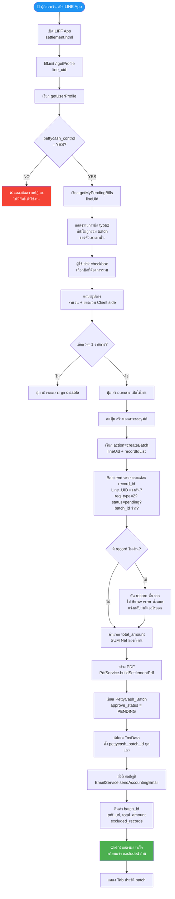
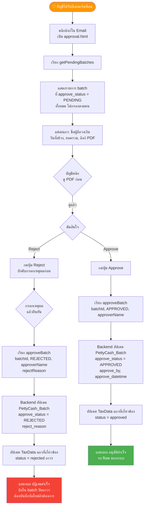
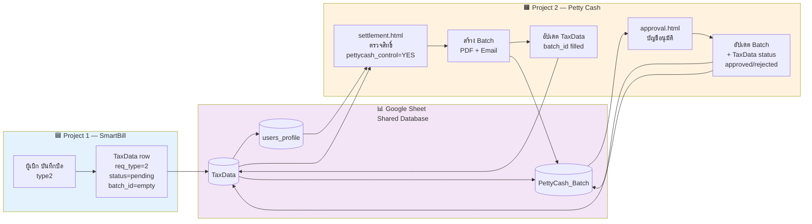
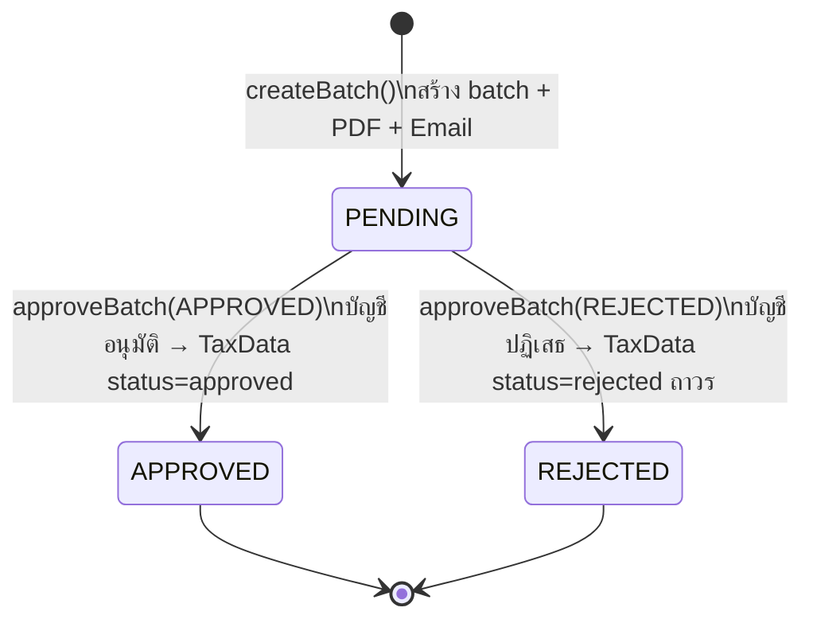
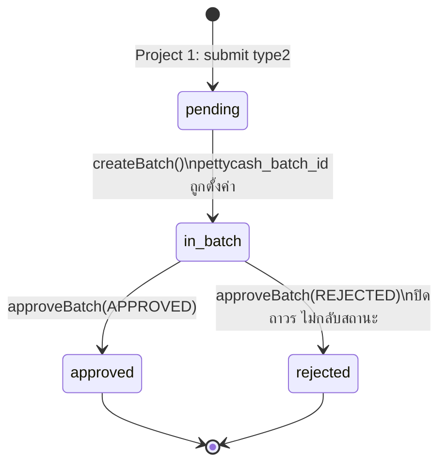

# PROJECT 2 — ระบบอนุมัติวงเงินสดย่อย (Petty Cash Settlement & Approval)
## Tech Spec v3.0 — แยกจาก TechSpec_AI_Smart_Billing_PettyCash_v3.md

> **ขอบเขตเอกสารนี้:** ครอบคลุมเฉพาะ **การรวม batch บิล + อนุมัติโดยบัญชี**  
> (Project 1 ระบบบันทึกบิลบนมือถือ อยู่ในเอกสารแยกต่างหาก)

---

## 🗂️ สารบัญ

1. ภาพรวมและขอบเขต (Scope)
2. System Flow Diagram (Mermaid)
3. สถาปัตยกรรม (Architecture)
4. โครงสร้างไฟล์ (Project Structure)
5. Configuration
6. Data Model
7. Business Rules
8. Functional Spec — Settlement (สร้าง batch)
9. Functional Spec — Approval (บัญชีอนุมัติ)
10. Functional Spec — PDF Generation
11. API Contract (เฉพาะ Project 2)
12. State Machine
13. Non-Functional Requirements
14. Email Spec
15. Google Doc Template & PDF Spec
16. Out of Scope (Project 2)
17. Integration Point กับ Project 1

---

## 1. ภาพรวมและขอบเขต (Scope)

**Project 2 ทำหน้าที่:**
- ผู้ถือวงเงิน (Petty Cash Holder) เลือกบิล type2 ที่บันทึกไว้ใน Project 1 มารวมเป็น batch
- ระบบสร้าง PDF สรุปพร้อมรูปบิล และส่งอีเมลให้บัญชี
- บัญชีเปิดหน้า approval ดู batch ที่รอ และ Approve/Reject

**สิ่งที่ Project 2 อ่านจาก Project 1:**
- ตาราง `TaxData`: เฉพาะแถวที่ `req_type = "2"`, `status = "pending"`, `pettycash_batch_id` ว่าง
- ตาราง `users_profile`: ตรวจสิทธิ์ `pettycash_control`
- คอลัมน์ `Pic_bill`: URL รูปบิลสำหรับแนบใน PDF

**สิ่งที่ Project 2 เขียนกลับไปใน Project 1:**
- อัปเดต `TaxData.pettycash_batch_id` (คอลัมน์ V)
- อัปเดต `TaxData.status` (คอลัมน์ T) → `approved` หรือ `rejected`

---

## 2. System Flow Diagram

### 2A. Flow: ผู้ถือวงเงิน — สร้าง Batch



---

### 2B. Flow: บัญชี — อนุมัติ/ปฏิเสธ Batch



---

### 2C. Overview: Integration Flow ระหว่าง Project 1 และ Project 2



---

## 3. สถาปัตยกรรม (Architecture)

```
┌────────────────────────────┐      ┌───────────────────────────────────────┐
│  LINE LIFF Client           │      │   Google Apps Script (Web App)         │
│  2 หน้าจอ                   │ HTTP │                                         │
│  settlement.html            │ POST │  Main.gs  → doGet() / doPost()          │
│  (ผู้ถือวงเงิน สร้าง batch) │─────▶│     ├─ Services/UserService.gs         │
│                             │      │     ├─ Services/BillService.gs         │
│  approval.html              │      │     ├─ Services/BatchService.gs        │
│  (บัญชี อนุมัติ)            │      │     ├─ Services/PdfService.gs          │
└────────────────────────────┘      │     ├─ Services/EmailService.gs        │
                                     │     └─ Services/SheetRepo.gs           │
                                     └──────────────┬────────────────────────┘
                                                     │
                         ┌───────────────────────────┼──────────────┐
                         ▼                           ▼              ▼
               Google Sheet (DB)           Google Drive         Gmail
          TaxData (อ่าน/อัปเดต)       รูปบิล (อ่าน)          ส่งอีเมลบัญชี
          PettyCash_Batch (เขียน)      PDF batch (เขียน)
          users_profile (อ่าน)
```

---

## 4. โครงสร้างไฟล์ (Project Structure)

### Backend — Google Apps Script (เพิ่มเติมจาก Project 1)

| ไฟล์ | หน้าที่ |
|---|---|
| `Config.gs` | เพิ่ม config: `SHEET_PETTYCASH_BATCH`, `DRIVE_FOLDER_ID_SETTLEMENT_PDF`, `EMAIL_ACCOUNTING`, `GOOGLE_DOC_TEMPLATE_ID` |
| `Services/BatchService.gs` | **[ใหม่]** `createBatch(lineUid, recordIdList)`, `getPendingBatches()`, `approveBatch(batchId, decision, approverName, rejectReason)` |
| `Services/PdfService.gs` | **[ใหม่]** `buildSettlementPdf(batchData, billRows)` |
| `Services/EmailService.gs` | เพิ่ม `sendAccountingEmail(...)` |
| `Services/BillService.gs` | เพิ่ม `getMyPendingBills(lineUid)` |

### Frontend

| ไฟล์ | ใช้โดย | รายละเอียด |
|---|---|---|
| `settlement.html` | ผู้ถือวงเงิน | เลือกบิล รวม batch — ดู 8 |
| `approval.html` | บัญชี | อนุมัติ/ไม่อนุมัติ batch — ดู 9 |

> **หมายเหตุ:** `doGet` ต้องรับ query param `?page=settlement` หรือ `?page=approval` เพื่อ serve ไฟล์ที่ถูกต้อง  
> ใช้ `HtmlService.createHtmlOutputFromFile` แยกตามพารามิเตอร์

---

## 5. Configuration (Script Properties — เพิ่มเติมจาก Project 1)

| Key | ตัวอย่างค่า | คำอธิบาย |
|---|---|---|
| `SPREADSHEET_ID` | `1amztKC_QEVv9H7u6ubGCJYEHCHo0NWnJhT6ksNQCpnA` | **ห้ามเปลี่ยน — ใช้ Sheet เดียวกับ Project 1** |
| `SHEET_PETTYCASH_BATCH` | `PettyCash_Batch` | **[ใหม่]** ต้องสร้างแท็บนี้ตอน deploy ครั้งแรก |
| `DRIVE_FOLDER_ID_SETTLEMENT_PDF` | *(สร้างใหม่)* | **[ใหม่]** โฟลเดอร์เก็บ PDF batch (แยกจากรูปบิล) |
| `EMAIL_ACCOUNTING` | *(ขอจากผู้ใช้ก่อน deploy)* | **[ใหม่] ต้องขอค่าจริงก่อน deploy** |
| `GOOGLE_DOC_TEMPLATE_ID` | *(สร้างใหม่)* | **[ใหม่]** Template Google Doc สำหรับสร้าง PDF |

---

## 6. Data Model

### 6.1 Sheet: `TaxData` — คอลัมน์ที่ Project 2 **อ่านและอัปเดต** (ไม่สร้างแถวใหม่)

| คอลัมน์ | Project 2 ทำอะไร |
|---|---|
| `Line_UID` (O) | อ่าน — ตรวจสอบว่าบิลเป็นของผู้ถือวงเงินที่ login อยู่ |
| `req_type` (U) | อ่าน — กรองเฉพาะ `"2"` |
| `status` (T) | อ่าน (pending) + เขียน (`approved`/`rejected` หลังบัญชีตัดสินใจ) |
| `pettycash_batch_id` (V) | อ่าน (ว่าง = ยังไม่ถูกรวม) + เขียน (ตั้ง batch_id หลัง createBatch) |
| `Net` (I) | อ่าน — ใช้คำนวณ total_amount ของ batch |
| `Pic_bill` (L) | อ่าน — URL รูปบิล สำหรับแนบใน PDF |
| `record_id` (P) | อ่าน — เป็น FK ใน `PettyCash_Batch.record_id_list` |
| `doc_date` (F), `Tax_docno` (E), `Vend_name` (C) | อ่าน — แสดงในตาราง PDF |
| `Project` (J) | อ่าน — แสดงในตาราง PDF |

### 6.2 Sheet: `users_profile` (อ่านอย่างเดียว)

| คอลัมน์ | Project 2 ใช้ |
|---|---|
| `line_uid` | ตรวจสิทธิ์ผู้เข้า settlement.html |
| `pettycash_control` | `YES` = เข้าได้; `NO` = แสดงข้อความปฏิเสธ |
| `Request_Name` | snapshot ชื่อผู้ถือใน PettyCash_Batch.holder_name |
| `emp_no` | แสดงใน PDF |

### 6.3 Sheet ใหม่: `PettyCash_Batch` — ต้องสร้างขึ้นใหม่ตอน deploy

| คอลัมน์ | ชนิดข้อมูล | บังคับ | คำอธิบาย |
|---|---|---|---|
| `batch_id` | String (PK, prefix `'`) | Y | `new Date().getTime()` string |
| `create_datetime` | Datetime | Y | เวลาสร้าง batch |
| `holder_line_uid` | String | Y | line_uid ผู้ถือวงเงิน |
| `holder_name` | String | Y | snapshot ชื่อผู้ถือ ณ เวลาสร้าง |
| `record_id_list` | String (CSV) | Y | `record_id` ทั้งหมดใน batch นี้ |
| `total_amount` | Number(2) | Y | SUM(Net) ของทุกแถวใน batch |
| `pdf_url` | String (URL) | Y | ลิงก์ PDF สรุป |
| `sent_email_to` | String | Y | snapshot อีเมลบัญชีที่ส่งไป |
| `sent_datetime` | Datetime | Y | เวลาส่งอีเมล (= create_datetime) |
| `approve_status` | `PENDING`/`APPROVED`/`REJECTED` | Y | ค่าเริ่มต้น `PENDING` |
| `approve_by` | String | N | ชื่อบัญชีที่ตัดสินใจ |
| `approve_datetime` | Datetime | N | เวลาที่ตัดสินใจ |
| `reject_reason` | String | N | **บังคับ** ถ้า `approve_status = REJECTED` |

> ไม่มีฟิลด์อ้างอิงเลขที่เอกสาร ERP (จบ flow ที่สถานะ approve เท่านั้น)

---

## 7. Business Rules (Project 2)

**R4 — สิทธิ์เข้าใช้ Settlement**
- ผู้ใช้ที่เปิด `settlement.html` ต้องมี `pettycash_control = "YES"` เท่านั้น
- ถ้าไม่ใช่ → แสดงข้อความปฏิเสธ

**R5 — createBatch เป็น Atomic Action**
- 1 ครั้งที่กด = สร้าง batch + PDF + ส่งอีเมล + set `PENDING` + set `pettycash_batch_id`
- ไม่มีสถานะ "แบบร่าง"  ไม่มีปุ่มยืนยันแยก

**R6 — Approval ไม่ต้องมี Login พิเศษ**
- เข้าจากลิงก์ในอีเมลได้เลย ไม่ต้องพัฒนาระบบยืนยันตัวตนรอบนี้

**R7 — Reject = ปิดถาวรทั้ง Batch**
- Reject ไม่ใช่การคืนบิลกลับแก้ไข — เป็นการยกเลิกทั้งชุด
- ทุกแถวใน batch → `status = "rejected"` ถาวร ไม่นำกลับมาเลือกใหม่ได้
- ถ้าบันทึกผิด ผู้เบิกต้องบันทึกบิลใหม่ใน Project 1

**R8 — Approve ปิด Flow ทันที**
- เมื่อ Approve → `approve_status = "APPROVED"`, TaxData ทุกแถว → `status = "approved"`
- จบ flow ของระบบ ไม่ติดตาม ERP ต่อ

**R10 — สิทธิ์ไฟล์ Drive**
- PDF batch ทุกไฟล์ต้องตั้ง `"Anyone with the link" (Viewer)` ทันทีหลังสร้าง

**R11 — Notification**
- ใช้เฉพาะอีเมล ไม่พัฒนา LINE push รอบนี้

---

## 8. Functional Spec — Settlement (`settlement.html` + `createBatch`)

**UI ต้องมี:**
- ตรวจสิทธิ์ R4 ก่อนแสดงเนื้อหา
- List บิล: checkbox + thumbnail รูปบิล + วันที่ + ยอด Net
  - แสดงเฉพาะบิลของตัวเอง: `Line_UID = ผู้ใช้ปัจจุบัน` AND `req_type = "2"` AND `status = "pending"` AND `pettycash_batch_id` ว่าง
- แถบสรุปล่าง: จำนวนที่เลือก + ยอดรวม (client คำนวณ UX)
- ปุ่ม "สร้างเอกสารขออนุมัติ" (disable ถ้าเลือก 0 รายการ)
- Tab ประวัติ: แสดง batch ที่เคยสร้าง พร้อมสถานะ

**ขั้นตอน `createBatch` (backend, atomic):**
1. ตรวจสอบทุก `record_id`: มีจริง, `Line_UID` ตรงกัน, `req_type = "2"`, `status = "pending"`, `batch_id` ว่าง  
   → ถ้าไม่ผ่าน: ตัดออก (ไม่ throw error ทั้งหมด) แจ้งกลับว่าตัดอะไรออก
2. สร้าง `batch_id`, ดึง `holder_name` จาก `users_profile`
3. คำนวณ `total_amount = SUM(Net)` ของแถวที่ผ่าน
4. เรียก `PdfService.buildSettlementPdf()` → ได้ `pdf_url`
5. เขียนแถวใหม่ใน `PettyCash_Batch` (`approve_status = "PENDING"`)
6. อัปเดต `TaxData`: ตั้ง `pettycash_batch_id` ทุกแถวที่เกี่ยวข้อง
7. เรียก `EmailService.sendAccountingEmail()`
8. คืนค่า `{ batch_id, pdf_url, total_amount, excluded_records: [...] }`

---

## 9. Functional Spec — Approval (`approval.html` + `approveBatch`)

**UI:**
- ไม่มี login พิเศษ (R6)
- แสดงทุก batch ที่ `approve_status = "PENDING"` (ไม่กรองตามคน)
- แต่ละแถว: ชื่อผู้ถือวงเงิน, วันที่สร้าง, ยอดรวม, ลิงก์ PDF (เปิดก่อนตัดสินใจ)
- ปุ่ม Approve → เรียก `approveBatch(batchId, "APPROVED", approverName)`
- ปุ่ม Reject → บังคับกรอกเหตุผลก่อน → เรียก `approveBatch(batchId, "REJECTED", approverName, rejectReason)`

**ขั้นตอน `approveBatch` (backend, ทันทีในการเรียกเดียว):**
- อัปเดต `PettyCash_Batch`: `approve_status`, `approve_by`, `approve_datetime`, `reject_reason`
- อัปเดต `TaxData` ทุกแถวใน `record_id_list` → `status = "approved"` หรือ `"rejected"`

---

## 10. Functional Spec — PDF Generation (`PdfService`)

1. สร้าง Google Doc ต้นแบบ (Template) เก็บ ID ที่ `GOOGLE_DOC_TEMPLATE_ID`
2. Placeholder ในรูปแบบ `{{field_name}}`:
   - `{{holder_name}}`, `{{emp_no}}`, `{{batch_id}}`, `{{create_date}}`, `{{total_amount}}`, `{{bill_count}}`
   - ตาราง `{{bill_table_row}}` (1 แถว/บิล: วันที่ / เลขที่บิล / ผู้ขาย / ยอด Net / Project)
3. ขั้นตอนสร้าง PDF:
   - คัดลอก template ด้วย `DriveApp.getFileById(templateId).makeCopy()`
   - เปิดด้วย `DocumentApp` → text replace ตาม placeholder
   - **แนบรูปบิลทุกใบต่อท้าย** (ดึงจาก `Pic_bill` URL, 1 หน้า/รูป หรือจัดกริด)
   - export PDF (`getAs('application/pdf')`)
   - บันทึกลง `DRIVE_FOLDER_ID_SETTLEMENT_PDF`
   - **ลบไฟล์ Google Doc สำเนาทิ้ง** (เก็บเฉพาะ PDF)
4. ตั้งสิทธิ์ `"Anyone with the link" (Viewer)` ก่อน return `pdf_url`

---

## 11. API Contract (Project 2)

ทุก request: `POST` ไป Web App URL เดียวกัน, body `{ action: "...", ...payload }`, response `{ success: boolean, data?, message? }`

| action | payload | data (success) |
|---|---|---|
| `getMyPendingBills` | `{ lineUid }` | `[{ record_id, doc_date, vend_name, net, pic_bill }, ...]` |
| `createBatch` | `{ lineUid, recordIdList: [...] }` | `{ batch_id, pdf_url, total_amount, excluded_records }` |
| `getPendingBatches` | `{}` | `[{ batch_id, holder_name, create_datetime, total_amount, pdf_url }, ...]` |
| `approveBatch` | `{ batchId, decision: "APPROVED"\|"REJECTED", approverName, rejectReason? }` | `"อัปเดตสถานะสำเร็จ"` |

> ทุก action ที่เขียนข้อมูล (`createBatch`, `approveBatch`) ต้องใช้ `LockService.getScriptLock()` (รอสูงสุด 30 วินาที)

---

## 12. State Machine

### `PettyCash_Batch.approve_status`



### `TaxData.status` (เฉพาะ type2 — Project 2 ดำเนินการ)



---

## 13. Non-Functional Requirements

- **Locking:** `createBatch` และ `approveBatch` ต้องใช้ `LockService` ครอบการทำงาน
- **Idempotency:** ปุ่ม "สร้างเอกสาร" และ "Approve/Reject" ต้อง disable ทันทีหลังกด
- **Security:** ห้าม hardcode API key/secret; ไฟล์แชร์ Anyone-with-link (ยอมรับความเสี่ยง)
- **Logging:** ทุก error ให้ `Logger.log()` พร้อม context (action, timestamp, message)
- **Timezone:** `Asia/Bangkok` (GMT+7) ทุกจุดที่ format วันที่/เวลา
- **ตัวเลขเงิน:** ทศนิยม 2 ตำแหน่งเสมอ

---

## 14. Email Spec

| รายการ | ค่า |
|---|---|
| ผู้ส่ง | บัญชี Google ที่รัน Apps Script (MailApp) |
| ผู้รับ | `EMAIL_ACCOUNTING` (**ต้องขอค่าจริงจากผู้ใช้ก่อน deploy**) |
| หัวข้อ | `ขออนุมัติเติมวงเงินสดย่อย - {holder_name} - {total_amount} บาท` |
| เนื้อหา | ชื่อผู้ถือ + จำนวนบิล + ยอดรวม + ลิงก์ PDF (ไม่แนบไฟล์ตรง) |
| Trigger | ทันทีหลัง createBatch สำเร็จ (= เวลาเดียวกับ create_datetime) |

---

## 15. Google Doc Template Spec

> สร้าง 1 ครั้งก่อน deploy แล้วเก็บ ID ไว้ที่ `GOOGLE_DOC_TEMPLATE_ID`

**Placeholder ที่ต้องมีใน Template:**

| Placeholder | แหล่งข้อมูล |
|---|---|
| `{{holder_name}}` | `users_profile.Request_Name` |
| `{{emp_no}}` | `users_profile.emp_no` |
| `{{batch_id}}` | สร้างใหม่ใน createBatch |
| `{{create_date}}` | วันที่สร้าง batch (GMT+7) |
| `{{total_amount}}` | SUM Net ของ batch |
| `{{bill_count}}` | จำนวนบิลใน batch |

**ส่วนของตาราง (Table):**
ระบบรองรับการแทรกข้อมูลลงในตาราง โดยจะหาแถวในตารางที่มี `{{doc_date}}`, `{{vend_name}}`, `{{tax_docno}}`, `{{net}}`, หรือ `{{bill_table_row}}` จากนั้นจะทำการ **คัดลอกทั้งแถว (Copy formatting)** แล้วแทนที่ข้อมูลในแต่ละช่อง:
- ผู้ใช้ต้องใส่ Placeholder เหล่านี้ลงในเซลล์ของตาราง **(แทรก > ตาราง)** เช่น `{{doc_date}}` ในช่องวันที่, `{{net}}` ในช่องยอดเงิน
- การแยกช่องทำให้สามารถควบคุม Format (เช่น ชิดขวา, ตัวหนา, ฟอนต์) แยกกันในแต่ละคอลัมน์ได้อิสระ
- **รูปภาพประกอบ (รูปบิล):** ไม่ต้องใส่ Placeholder ใดๆ ในเอกสาร สคริปต์จะจัดการขึ้นหน้าใหม่, พิมพ์หัวข้อ "เอกสารประกอบ (รูปบิล)", และวนลูปดึงรูปภาพทั้งหมดมาเรียงต่อกันให้ที่ด้านล่างสุดโดยอัตโนมัติ (รองรับหลายรูปลิงก์ที่คั่นด้วยเครื่องหมาย `,`)

---

## 16. Out of Scope (Project 2)

- การคำนวณวงเงินคงเหลือ real-time
- ระบบ login/สิทธิ์ approval เข้มงวด (เข้าได้ทุกคนที่มีลิงก์)
- การ approve/reject แบบ partial (เลือกทีละบิล) — ปัจจุบัน approve/reject ทั้ง batch
- การอ้างอิงเลขที่เอกสาร ERP กลับเข้าระบบ

---

## 17. Integration Point กับ Project 1

| จุดเชื่อม | รายละเอียด |
|---|---|
| **Google Sheet ร่วม** | `SPREADSHEET_ID` เดียวกัน — ห้ามสร้างใหม่ |
| **ตาราง TaxData** | Project 2 อ่านแถว `req_type=2, status=pending, batch_id=empty`; เขียนกลับ col V (`pettycash_batch_id`) และ col T (`status`) |
| **คอลัมน์ interface** | `req_type` (U) และ `pettycash_batch_id` (V) คือสัญญาระหว่าง 2 project — **ห้ามเปลี่ยนชื่อ/ลำดับ** |
| **ชื่อคอลัมน์ Data** | การอ้างอิงคอลัมน์จาก Sheet `TaxData` อาจพบปัญหาตัวพิมพ์ใหญ่-เล็ก (เช่น `Vend_name` vs `vend_name`) Backend ต้องทำ Mapping fallback ให้ครอบคลุมทุกกรณีทั้งในส่วน UI และ PdfService เพื่อป้องกันค่า `NaN` หรือตกหล่น |
| **Drive รูปบิล** | Project 2 อ่าน URL จาก `Pic_bill` เพื่อแนบใน PDF (รองรับ String คั่นด้วย comma สำหรับหลายรูป) |
| **GAS Web App URL** | แนะนำ deploy เป็น Web App เดียว — ใช้ `action` ต่างกันผ่าน `doPost` router |
| **ข้อตกลงสำคัญ** | Project 2 **ห้ามลบ/แก้ไข** แถวใน TaxData — ทำได้เฉพาะ อัปเดตค่าใน col T และ V เท่านั้น |

---

## 18. Lessons Learned & Fine-Tuning (อัปเดตจากการทดสอบจริง)

1. **Frontend Architecture:** เนื่องจากปัญหา `iframe` ของ LINE LIFF ไม่สามารถเปิด GAS Web App ได้โดยตรง จึงต้องใช้ **สถาปัตยกรรมแยกส่วน (Decoupled)**
   - **UI:** สร้างเป็นไฟล์ Static HTML (เช่น `index.html`) โฮสต์บน Github Pages
   - **Backend:** เป็น GAS Web App (Deploy as "Anyone") ที่เปิดรับ HTTP `POST` Request แบบ `Content-Type: text/plain` (เพื่อหลีกเลี่ยง CORS Preflight Error)
   - หน้า UI ใช้ `fetch()` เพื่อยิง Payload ไปยัง GAS Web App
2. **การป้องกัน Cache ของ LIFF:** มือถือมักจะจำหน้าเว็บเก่า (Aggressive Caching) ต้องใส่ `<meta>` tag ห้ามแคชทั้ง `Cache-Control`, `Pragma`, และ `Expires` เพื่อให้ผู้ใช้ได้หน้า UI ล่าสุด
3. **การตกแต่ง UI (Flexbox):** การทำหน้าจอที่มี Footer ปักหมุด หรือ Layout ที่ต้อง scroll ในมือถือ การใช้ CSS `padding-bottom` ธรรมดาอาจโดน Flexbox บังกลบ ควรใช้ Element `div` ว่าง (Spacer) ใส่ความสูงไว้ล่างสุดแทนเพื่อบังคับระยะห่างให้ชัวร์ที่สุด
4. **Google Doc Table Templating:**
   - การใช้ `appendTable(String[][])` อาจพังได้ง่ายถ้าข้อมูลข้างในมี Data type ผสม (Number, String) ต้องใช้ `String(...)` เสมอ
   - การทำ Templating ตารางที่สวยและยืดหยุ่นที่สุด คือการดักหาคีย์เวิร์ดในตาราง แล้วใช้คำสั่ง `templateRow.copy()` และ `table.insertTableRow(index, copiedRow)` เพื่อคงรูปแบบตารางไว้ทุกประการ
5. **Data Mapping Fallback:** ตัวแปรข้อมูลที่ดึงจาก Spreadsheet มักจะพบปัญหา Typo การใช้อักษรพิมพ์เล็ก-ใหญ่ไม่ตรงกัน (เช่น `Record_id` vs `record_id`, `Pic_bill` vs `pic_bill`) ควรสร้าง Mapped Object ตรงกลางที่ดักไว้ทุกทาง (`bill['Net'] || bill['net']`) ก่อนส่งต่อไปให้ Service อื่นๆ (โดยเฉพาะก่อนโยนเข้า PdfService) เพื่อตัดปัญหา undefined หรือ NaN แบบถอนรากถอนโคน
